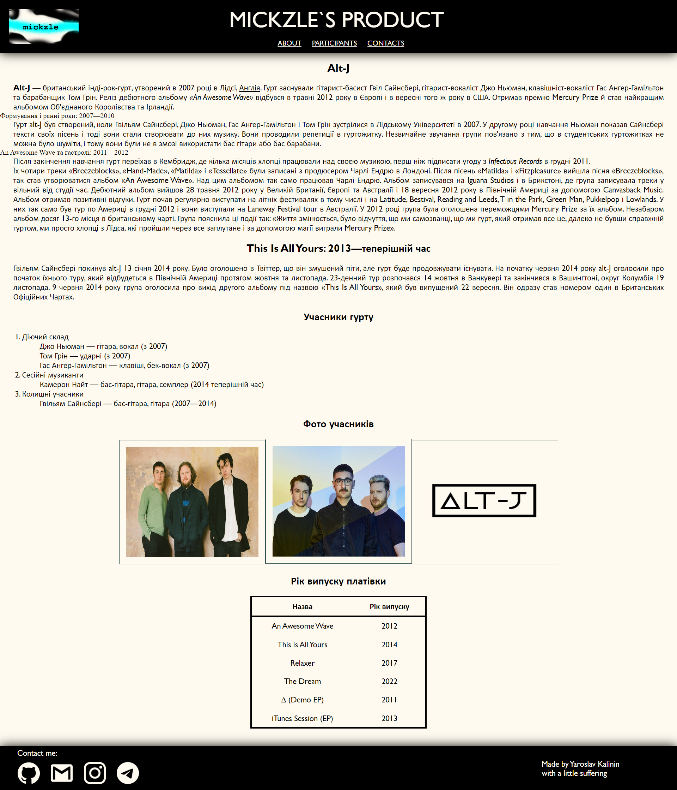

# Тема: ОСНОВИ РОБОТИ З HTML5
### Варіант: 15

### Вимоги до розв’язання завдання:  
1. Вивчити структуру html-документу, її основні елементи
2. Розглянути теги та їх атрибути серед наведеного списку:
   - для створення заголовків
   - для форматування тексту
   - для роботи з цитатами
   - для роботи зі зображеннями
   - для створення посилань
   - для створення абзаців
   - для роботи з таблицями
   - для роботи зі списками
3. Створити сторінку про біографію обраної вами персони, наприклад, улюблений винахідник, актор, тощо 
---
Вигляд готової сторінки:  
