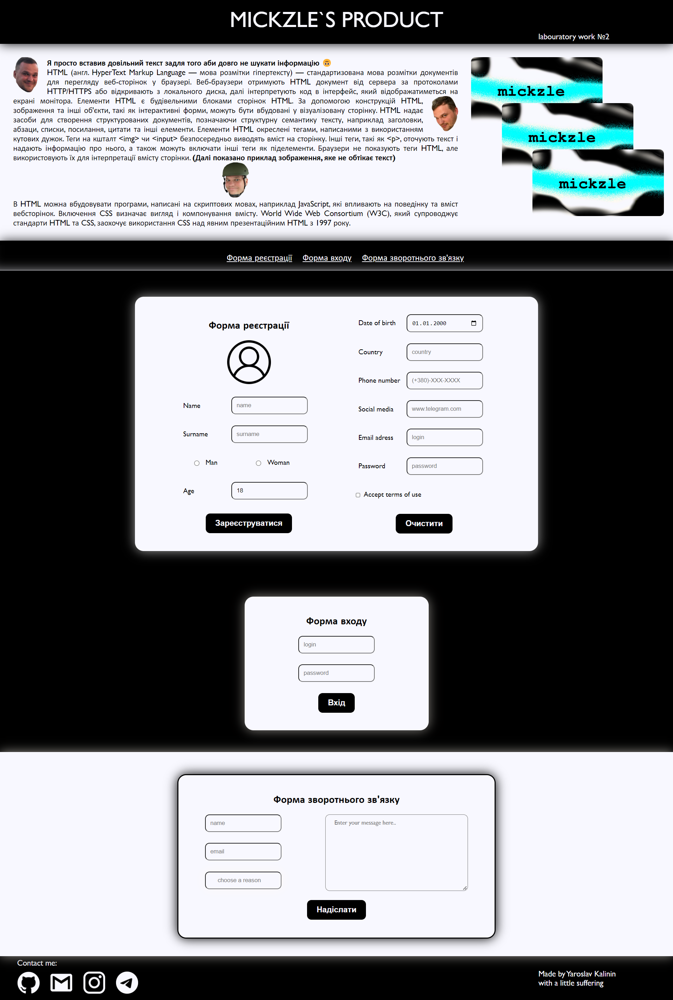

# Тема: СТВОРЕННЯ ФОРМ В HTML ТА ПОЗИЦІЮВАННЯ ЕЛЕМЕНТІВ CSS 
### Варіант: 15

### Вимоги до розв’язання завдання:  
1. Вивчити html-теги та атрибути з лекційного матеріалу
2. Дослідити та використати в свої роботі такі теги:
   - \<form> … \</form> 
   - \<input> … \<input>
   - \<textarea> … \</textarea>
   - \<button> … \</button>
   - \<select> … \</select>
   - \<option> … \</option>
   - \<fieldset> … \</fieldset>
   - \<datalist> … \</datalist>
   - \<label> … \</label>
   - \<legend> … \</legend>
3. Вивчити теорію блочної моделі та позиціонування
4. Створити сторінку з наведеними вище формами, використовуючи всі набуті знання по тегами і атрибутам та властивостям CSS. Мають бути представлені такі форми:
   - входу,
   - реєстрації,
   - зворотного зв’язку,
5. Реалізувати розміщення елементів за допомогою різних типів позиціонування
6. Використати CSS для оформлення сторінки 
---
Вигляд готової сторінки:  

